<div align="center">



<br/>

[](https://github.com/gnanam1990)

<p>
  <a href="https://github.com/gnanam1990"></a>
  <a href="https://x.com/pindropsx"></a>
  <a href="https://t.me/gnanamccnOOb"></a>
  
  
</p>

</div>



## `$ cat about.md`

```text
AI & full-stack engineer building onchain agent infrastructure and AI developer tooling.
Most of my work lives where autonomous agents meet real systems: payments, wallets,
automation, and reputation, alongside practical AI tooling and full-stack products.
```

- `>` **Core developer of [Zero](https://github.com/Gitlawb/zero)** — terminal AI coding agent: *your model, your machine, your rules*
- `>` **Developer @ [Gitlawb](https://github.com/Gitlawb)** — openclaude + decentralized git / onchain agent protocol
- `>` **Onchain agents** — Base + Kite stacks: wallets, payments, subscriptions, automation, trading
- `>` **Open source** — contributions to high-visibility AI projects
- `>` **Stack** — TypeScript · Python · Rust · Solidity · React · Node.js


## `$ ./loc --year 2026 --author gnanam1990`

<div align="center">



<br/>

| metric | value |
| :--- | ---: |
| `lines_added` | **2,141,596** |
| `lines_deleted` | **119,501** |
| `net_change` | **+2,022,095** |
| `active_repos` | 150 |
| `repos_scanned` | 198 |

<sub>Counts commits authored by <code>gnanam1990</code> in <b>2026</b> across <b>owned non-fork repos</b> (including private), via GitHub's contributor stats API.</sub>

<br/><br/>

<p>
  
  
  
  
  
  
</p>

</div>


## `$ ls -la ~/projects`

```text
drwxr-xr-x  zero             core developer · terminal AI coding agent
drwxr-xr-x  onchain-agents   wallets · payments · subscriptions · automation · trading
drwxr-xr-x  sherpa           natural-language agent for Base · smart wallet + sponsored gas
drwxr-xr-x  gitlawb          openclaude + decentralized git / onchain agent protocol
drwxr-xr-x  pr-review-agent  approval-first AI PR review · CLI + MCP · 108K+ LOC
```

<table>
  <tr>
    <td width="50%" valign="top">
      <h3>🖥️ Zero — Core Developer</h3>
      <p>Terminal AI coding agent on one idea: <em>your model, your machine, your rules</em>. Runtime &amp; backend core: providers, sessions, tools, streaming, review pipeline.</p>
      <a href="https://github.com/Gitlawb/zero"></a>
      
    </td>
    <td width="50%" valign="top">
      <h3>🤖 Onchain Agent Stack</h3>
      <p>Autonomous-agent infrastructure: wallets, payments, subscriptions, automation, research &amp; trading agents, reputation.</p>
      
    </td>
  </tr>
  <tr>
    <td width="50%" valign="top">
      <h3>⛓️ Sherpa</h3>
      <p>Natural-language agent for Base: plain English in, onchain actions out. Smart Wallet + sponsored gas.</p>
      <a href="https://github.com/gnanam1990/sherpa"></a>
    </td>
    <td width="50%" valign="top">
      <h3>🏗️ Gitlawb</h3>
      <p>Developer building openclaude and the Gitlawb protocol: decentralized git, onchain contracts, AI-agent tooling.</p>
      <a href="https://github.com/Gitlawb"></a>
    </td>
  </tr>
  <tr>
    <td colspan="2" valign="top">
      <h3>🛡️ personal-pr-review-agent</h3>
      <p>Approval-first AI PR review agent (CLI + MCP, multi-provider). 108K+ lines of TypeScript across 710 files, 62 commits, 22 releases — security detectors, review engine, and a hosted review dashboard.</p>
      <a href="https://github.com/gnanam1990/personal-pr-review-agent"></a>
      
      
      
    </td>
  </tr>
</table>


## `$ gh repo list --featured`

<table>
  <tr>
    <td width="50%" valign="top">
      <a href="https://github.com/gnanam1990/argus"><b>argus</b></a><br/>
      
      <br/>
      <sub>Provider-agnostic computer-use agent, written in Go: observe &rarr; think &rarr; act, with swappable set-of-marks grounding and a single-binary driver.</sub>
    </td>
    <td width="50%" valign="top">
      <a href="https://github.com/gnanam1990/polymarket-copy-bot"><b>polymarket-copy-bot</b></a><br/>
      
      <br/>
      <sub>Copy trades from top Polymarket wallets. Multi-wallet tracking, ROI filtering, paper/live trading, real-time Flask dashboard.</sub>
    </td>
  </tr>
  <tr>
    <td width="50%" valign="top">
      <a href="https://github.com/gnanam1990/sherpa"><b>sherpa</b></a><br/>
      
      <br/>
      <sub>Natural-language DeFi agent for Base. Type plain English, Sherpa does the onchain part. Coinbase Smart Wallet + sponsored gas.</sub>
    </td>
    <td width="50%" valign="top">
      <a href="https://github.com/gnanam1990/personal-pr-review-agent"><b>personal-pr-review-agent</b></a><br/>
      
      <br/>
      <sub>Approval-first AI PR review agent (CLI + MCP, multi-provider). 108K+ LOC, security detectors, review engine, hosted dashboard.</sub>
    </td>
  </tr>
  <tr>
    <td width="50%" valign="top">
      <a href="https://github.com/gnanam1990/witness"><b>witness</b></a><br/>
      
      <br/>
      <sub>Onchain auditing agent.</sub>
    </td>
    <td width="50%" valign="top">
      <a href="https://github.com/gnanam1990/agent-registry"><b>agent-registry</b></a><br/>
      
      <br/>
      <sub>Composable on-chain agent identity, reputation &amp; USDC escrow primitives, with a read-only dashboard.</sub>
    </td>
  </tr>
</table>


## `$ which lang && cat stack.txt`

<div align="center">


<br/><br/>


</div>


## `$ git log --graph --oneline --author=gnanam1990`

<div align="center">


</div>


## `$ ./contributions --animate`

<div align="center">

<picture>
  <source media="(prefers-color-scheme: dark)" srcset="https://raw.githubusercontent.com/gnanam1990/gnanam1990/output/github-contribution-grid-snake-dark.svg" />
  <source media="(prefers-color-scheme: light)" srcset="https://raw.githubusercontent.com/gnanam1990/gnanam1990/output/github-contribution-grid-snake.svg" />
  
</picture>

<sub>Regenerated automatically by GitHub Actions.</sub>

</div>


## `$ trophy --list`

<div align="center">


</div>


## `$ contact --connect`

<div align="center">

<a href="https://x.com/pindropsx"></a>
<a href="https://t.me/gnanamccnOOb"></a>
<a href="https://github.com/gnanam1990"></a>

<br/><br/>

<sub><code>$ exit 0</code> — thanks for scrolling · session resumes on next commit</sub>


</div>
