  
  
  
  

## 📈 2026 · Lines of Code

 

| | |
| :---: | :---: |
| **Lines added** | **1,933,266** |
| **Lines deleted** | **111,830** |
| **Net change** | **+1,821,436** |
| Active owned repos | 148 |
| Owned repos scanned | 197 |

  
  
  

Counts commits authored by <code>gnanam1990</code> in <b>2026</b> across <b>owned non-fork repos</b> (including private), via GitHub’s contributor stats API.

## 🏢 Organizations & Affiliations

 

<b>Core developer</b> of Zero &nbsp;·&nbsp; <b>Developer</b> @ Gitlawb &nbsp;·&nbsp; <b>Contributor</b> @ openclaw &nbsp;·&nbsp; <b>Contributor</b> @ open-webui &nbsp;·&nbsp; <b>Contributor</b> @ Hermes Agent

## 👋 About

I'm an AI & full-stack engineer who builds **onchain agent infrastructure** and **AI developer tooling**. Most of my work lives where autonomous agents meet real systems — payments, wallets, automation, and reputation — alongside practical AI tooling and full-stack products.

- 🖥️ **Core developer of [`Zero`](https://github.com/Gitlawb/zero)** — terminal AI coding agent: *your model, your machine, your rules*
- 🏗️ **Developer @ [Gitlawb](https://github.com/Gitlawb)** — openclaude + decentralized git / onchain agent protocol
- ⛓️ **Onchain agents** — Base + Kite stacks (wallets, payments, automation, trading agents)
- 🤝 Open-source contributions to high-visibility AI projects
- ⚡ **Stack:** TypeScript · Python · Rust · Solidity · React · Node.js

## 🚀 What I Build

<table>
  <tr>
    <td colspan="2" valign="top">
      <h3>🖥️ Zero — Core Developer</h3>
      
Terminal AI coding agent on one idea: <em>your model, your machine, your rules</em>. Runtime &amp; backend core — providers, sessions, tools, streaming, and review pipeline.

      
      
    </td>
  </tr>
  <tr>
    <td width="50%" valign="top">
      <h3>🤖 Onchain Agent Stack</h3>
      
Autonomous-agent infrastructure — wallets, payments, subscriptions, automation, research &amp; trading agents, reputation.

      
    </td>
    <td width="50%" valign="top">
      <h3>⛓️ Sherpa</h3>
      
Natural-language agent for Base — plain English in, onchain actions out. Smart Wallet + sponsored gas.

      
    </td>
  </tr>
  <tr>
    <td width="50%" valign="top">
      <h3>🧠 openclaude — Core Contributor</h3>
      
AI coding agent that runs anywhere and uses any model — deep work on runtime and tooling.

      
    </td>
    <td width="50%" valign="top">
      <h3>🏗️ Gitlawb</h3>
      
Developer building openclaude and the Gitlawb protocol — decentralized git, onchain contracts, AI-agent tooling.

      
    </td>
  </tr>
</table>

## 🧰 Tech Stack

 
 

## 📊 GitHub Snapshot

## 🏆 Trophies

  

## 🐍 Contribution Animation

<picture>
  <source media="(prefers-color-scheme: dark)" srcset="https://raw.githubusercontent.com/gnanam1990/gnanam1990/output/github-contribution-grid-snake-dark.svg" />
  <source media="(prefers-color-scheme: light)" srcset="https://raw.githubusercontent.com/gnanam1990/gnanam1990/output/github-contribution-grid-snake.svg" />
  
</picture>

Regenerated automatically by GitHub Actions.

## 🎯 Current Focus

`Onchain AI agents` · `Agent payments & infrastructure` · `AI developer tooling` · `1.93M+ lines shipped in 2026` · `Full-stack product work`

## 📬 Contact

  
  

  

