  
  
  
  

## 👋 About

I'm an AI & full-stack engineer who builds **onchain agent infrastructure** and **AI developer tooling**. Most of my work lives where autonomous agents meet real systems — payments, wallets, automation, and reputation — alongside practical AI tooling and full-stack products. I like working inside active codebases where debugging, implementation quality, and careful review matter.

- 🏗️ **Developer @ [Gitlawb](https://github.com/Gitlawb)** — building [`openclaude`](https://github.com/Gitlawb/openclaude) and the Gitlawb protocol (decentralized git node, onchain contracts, AI-agent tooling)
- 🧠 **Core contributor** to [`Gitlawb/openclaude`](https://github.com/Gitlawb/openclaude) — #3 contributor on a 28k★ AI coding agent that runs anywhere and uses any model
- 🤝 Contributor to [`openclaw/openclaw`](https://github.com/openclaw/openclaw) (378k★) and [`open-webui/open-webui`](https://github.com/open-webui/open-webui)
- 🤖 Building a full **onchain AI-agent stack** on [Kite](https://github.com/gnanam1990?tab=repositories&q=kite) — wallets, payments, automation, research & trading agents
- ⛓️ Author of [`sherpa`](https://github.com/gnanam1990/sherpa) — a natural-language onchain agent for **Base** (Smart Wallet + sponsored gas)
- ⚡ Main stack: TypeScript, Python, Rust, Solidity, React, Node.js

## 🚀 What I Build

<table>
  <tr>
    <td width="50%" valign="top">
      <h3>🤖 Kite Agent Ecosystem</h3>
      
A full stack of autonomous-agent infrastructure on the Kite blockchain — wallets, payments, subscriptions, automation studio, research & trading agents, and agent reputation.

      
    </td>
    <td width="50%" valign="top">
      <h3>⛓️ Sherpa</h3>
      
Natural-language agent for <a href="https://github.com/gnanam1990/sherpa">Base</a> — type plain English, Sherpa does the onchain part. Coinbase Smart Wallet + sponsored gas. MIT licensed.

      
    </td>
  </tr>
  <tr>
    <td width="50%" valign="top">
      <h3>🧠 openclaude — Core Contributor</h3>
      
<strong>#3 contributor</strong> to <a href="https://github.com/Gitlawb/openclaude">Gitlawb/openclaude</a> (28k★) — an AI coding agent that runs anywhere and uses any model.

      
    </td>
    <td width="50%" valign="top">
      <h3>🏗️ Gitlawb</h3>
      
Developer at <a href="https://github.com/Gitlawb">Gitlawb</a> — building openclaude and the Gitlawb protocol: a decentralized git node, onchain contracts, and parallel AI-agent tooling.

      
    </td>
  </tr>
</table>

 

<strong>Open-source contributions</strong>

  

## 🧰 Tech Stack

 
 

## 📊 GitHub Snapshot

## 🏆 Trophies

  

## 🐍 Contribution Animation

<picture>
  <source media="(prefers-color-scheme: dark)" srcset="https://raw.githubusercontent.com/gnanam1990/gnanam1990/output/github-contribution-grid-snake-dark.svg" />
  <source media="(prefers-color-scheme: light)" srcset="https://raw.githubusercontent.com/gnanam1990/gnanam1990/output/github-contribution-grid-snake.svg" />
  
</picture>

Regenerated automatically by GitHub Actions.

## 💼 Selected Projects

| Project | Description |
| --- | --- |
| [`sherpa`](https://github.com/gnanam1990/sherpa) | Natural-language onchain agent for Base — plain English in, onchain actions out. Smart Wallet + sponsored gas, MIT licensed. |
| [`kiteagentos`](https://github.com/gnanam1990/kiteagentos) | Operating system / control plane for autonomous Kite agents. |
| [`agentfi-app`](https://github.com/gnanam1990/agentfi-app) | DeFi platform on Kite Mainnet — DEX, liquid staking, and yield aggregation. |
| [`kitepay`](https://github.com/gnanam1990/kitepay) | Stripe-style, agent-callable payment links on the Kite blockchain. |
| [`kite-research-agent`](https://github.com/gnanam1990/kite-research-agent) | Autonomous research analyst for Kite wallets, contracts, and ecosystem activity. |
| [`Gitlawb/openclaude`](https://github.com/Gitlawb/openclaude) | Core contributor (#3) — an open AI coding agent that runs anywhere and uses any model. |

## 🎯 Current Focus

`Onchain AI agents` · `Agent payments & infrastructure` · `AI developer tooling` · `Automation` · `Full-stack product work`

## 📬 Contact

  
  

  

