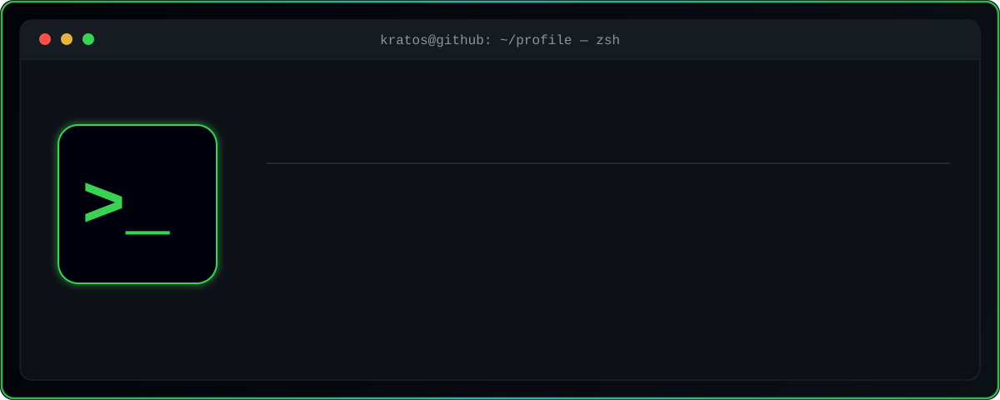
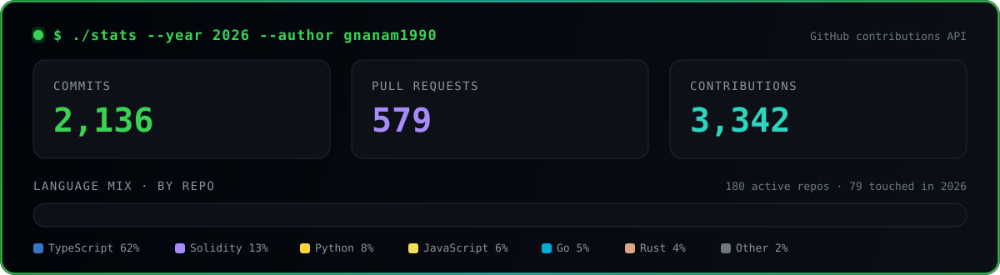
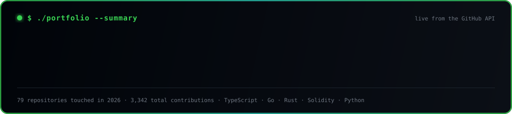

<div align="center">



<br/>

[](https://github.com/gnanam1990)

<p>
  <a href="https://github.com/gnanam1990"></a>
  <a href="https://x.com/pindropsx"></a>
  <a href="https://t.me/gnanamccnOOb"></a>
  
  
</p>

</div>


## `$ cat about.md`

```text
AI & full-stack engineer building onchain agent infrastructure and AI developer tooling.
Most of my work lives where autonomous agents meet real systems: payments, wallets,
automation, and reputation, alongside practical AI tooling and full-stack products.
```

- `>` **Core developer of [Zero](https://github.com/Gitlawb/zero)** — terminal AI coding agent: *your model, your machine, your rules*
- `>` **Developer @ [Gitlawb](https://github.com/Gitlawb)** — openclaude + decentralized git / onchain agent protocol
- `>` **Onchain agents** — Base + Kite stacks: wallets, payments, subscriptions, automation, trading
- `>` **Open source** — contributions to high-visibility AI projects
- `>` **Stack** — TypeScript · Python · Rust · Solidity · React · Node.js


## `$ ./stats --year 2026 --author gnanam1990`

<div align="center">



<br/>

| metric | value |
| :--- | ---: |
| `commits` | **2,136** |
| `pull_requests` | **579** |
| `total_contributions` | **3,342** |
| `lines_added` | 11,647,425 |
| `lines_deleted` | 936,369 |
| `net_change` | +10,711,056 |
| `active_repos` | 180 |
| `repos_scanned` | 208 / 236 |

<sub>Commits, PRs and contributions for <b>2026</b> via GitHub's contributions API. Line counts come from the contributor-stats API over <b>owned non-fork repos</b> (including private); it diffs <i>every</i> file in a commit, so vendored dependencies, lockfiles and generated bundles are counted &mdash; treat them as repository churn, not hand-written code. 28 of 236 repos returned no stats.</sub>

<br/><br/>

<p>
  
  
  
  
  
  
</p>

</div>


## `$ ls -la ~/projects`

```text
drwxr-xr-x  zero             core developer · terminal AI coding agent
drwxr-xr-x  onchain-agents   wallets · payments · subscriptions · automation · trading
drwxr-xr-x  sherpa           natural-language agent for Base · smart wallet + sponsored gas
drwxr-xr-x  gitlawb          openclaude + decentralized git / onchain agent protocol
drwxr-xr-x  flowops          agent-payment policy, authorization & settlement evidence
drwxr-xr-x  sieve            zero-infra, provider-agnostic PR review · bring your own model
```

<table>
  <tr>
    <td width="50%" valign="top">
      <h3>🖥️ Zero — Core Developer</h3>
      <p>Terminal AI coding agent on one idea: <em>your model, your machine, your rules</em>. Runtime &amp; backend core: providers, sessions, tools, streaming, review pipeline.</p>
      <a href="https://github.com/Gitlawb/zero"></a>
      
    </td>
    <td width="50%" valign="top">
      <h3>🤖 Onchain Agent Stack</h3>
      <p>Autonomous-agent infrastructure: wallets, payments, subscriptions, automation, research &amp; trading agents, reputation.</p>
      
    </td>
  </tr>
  <tr>
    <td width="50%" valign="top">
      <h3>⛓️ Sherpa</h3>
      <p>Natural-language agent for Base: plain English in, onchain actions out. Smart Wallet + sponsored gas.</p>
      <a href="https://github.com/gnanam1990/sherpa"></a>
    </td>
    <td width="50%" valign="top">
      <h3>🏗️ Gitlawb</h3>
      <p>Developer building openclaude and the Gitlawb protocol: decentralized git, onchain contracts, AI-agent tooling.</p>
      <a href="https://github.com/Gitlawb"></a>
    </td>
  </tr>
  <tr>
    <td colspan="2" valign="top">
      <h3>🧪 sieve — Zero-Infra PR Review</h3>
      <p>Provider-agnostic pull-request reviewer in Go. Runs anywhere a binary runs — no server, no webhook plumbing, no vendor lock-in. Bring your own model; sieve does the diff reasoning, risk ranking, and inline commenting.</p>
      <a href="https://github.com/gnanam1990/sieve"></a>
      
      
    </td>
  </tr>
</table>


## `$ gh repo list --public --sort=substance`

<table>
  <tr>
    <td width="50%" valign="top">
      <a href="https://github.com/gnanam1990/sherpa"><b>sherpa</b></a><br/>
      
      <br/>
      <sub>Natural-language DeFi agent for Base. Type plain English, Sherpa does the onchain part. Coinbase Smart Wallet + sponsored gas.</sub>
    </td>
    <td width="50%" valign="top">
      <a href="https://github.com/gnanam1990/flowops"><b>flowops</b></a><br/>
      
      <br/>
      <sub>Policy, authorization, settlement evidence and delivery assurance for autonomous agent payments on Base. 365 commits and counting.</sub>
    </td>
  </tr>
  <tr>
    <td width="50%" valign="top">
      <a href="https://github.com/gnanam1990/argus"><b>argus</b></a><br/>
      
      <br/>
      <sub>Provider-agnostic computer-use agent in Go: observe &rarr; think &rarr; act, with swappable set-of-marks grounding and a single-binary driver.</sub>
    </td>
    <td width="50%" valign="top">
      <a href="https://github.com/gnanam1990/snapfall"><b>snapfall</b></a><br/>
      
      <br/>
      <sub>The self-financing AI workforce, built on Arc &mdash; programmable agents that earn, budget and pay for their own compute.</sub>
    </td>
  </tr>
  <tr>
    <td width="50%" valign="top">
      <a href="https://github.com/gnanam1990/forge"><b>forge</b></a><br/>
      
      <br/>
      <sub>An original, self-contained coding agent written from scratch in Rust. No framework, no wrapper &mdash; the whole loop.</sub>
    </td>
    <td width="50%" valign="top">
      <a href="https://github.com/gnanam1990/sieve"><b>sieve</b></a><br/>
      
      <br/>
      <sub>Zero-infra, provider-agnostic pull-request reviewer. Bring your own model; ship review automation without a server.</sub>
    </td>
  </tr>
  <tr>
    <td width="50%" valign="top">
      <a href="https://github.com/gnanam1990/agent-registry"><b>agent-registry</b></a><br/>
      
      <br/>
      <sub>Composable onchain agent identity, reputation &amp; USDC escrow primitives, with a read-only dashboard.</sub>
    </td>
    <td width="50%" valign="top">
      <a href="https://github.com/gnanam1990/heirloom-protocol"><b>heirloom-protocol</b></a><br/>
      
      <br/>
      <sub>Non-custodial asset-continuity vault for Base &mdash; liveness-aware recovery so a wallet outlives the person holding the keys.</sub>
    </td>
  </tr>
  <tr>
    <td width="50%" valign="top">
      <a href="https://github.com/gnanam1990/arcpayments"><b>arcpayments</b></a><br/>
      
      <br/>
      <sub>Agentic-commerce tooling for Arc: wallets, x402 paywalls and machine-payable endpoints.</sub>
    </td>
    <td width="50%" valign="top">
      <a href="https://github.com/gnanam1990/sherpapay"><b>sherpapay</b></a><br/>
      
      <br/>
      <sub>Plain-English payments for MiniPay. Say what you want to send; it settles onchain.</sub>
    </td>
  </tr>
  <tr>
    <td width="50%" valign="top">
      <a href="https://github.com/gnanam1990/polymarket-copy-bot"><b>polymarket-copy-bot</b></a><br/>
      
      <br/>
      <sub>Copy trades from top Polymarket wallets. Multi-wallet tracking, ROI filtering, paper/live modes, real-time Flask dashboard.</sub>
    </td>
    <td width="50%" valign="top">
      <a href="https://github.com/gnanam1990/latchwork"><b>latchwork</b></a><br/>
      
      <br/>
      <sub>Lock what matters, let a local agent solve the rest. Constraint-first automation that keeps humans on the invariants.</sub>
    </td>
  </tr>
</table>

<sub>All twelve are <b>public</b> &mdash; every link above resolves for everyone. Private work lives in the other half of the account.</sub>


## `$ which lang && cat stack.txt`

<div align="center">


<br/><br/>


</div>


## `$ git log --graph --oneline --author=gnanam1990`

<div align="center">


</div>


## `$ ./contributions --animate`

<div align="center">

<picture>
  <source media="(prefers-color-scheme: dark)" srcset="https://raw.githubusercontent.com/gnanam1990/gnanam1990/output/github-contribution-grid-snake-dark.svg" />
  <source media="(prefers-color-scheme: light)" srcset="https://raw.githubusercontent.com/gnanam1990/gnanam1990/output/github-contribution-grid-snake.svg" />
  
</picture>

<sub>Regenerated automatically by GitHub Actions.</sub>

</div>


## `$ ./portfolio --summary`

<div align="center">



</div>


## `$ contact --connect`

<div align="center">

<a href="https://x.com/pindropsx"></a>
<a href="https://t.me/gnanamccnOOb"></a>
<a href="https://github.com/gnanam1990"></a>

<br/><br/>

<sub><code>$ exit 0</code> — thanks for scrolling · session resumes on next commit</sub>


</div>
